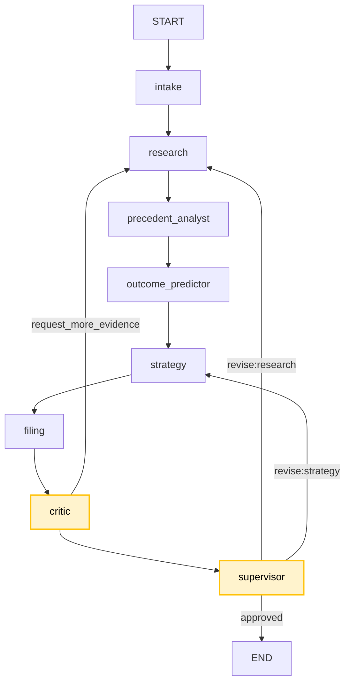
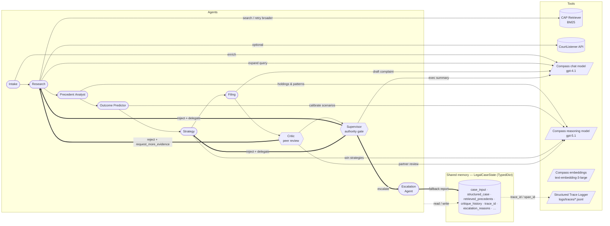

# Legal Intelligence — Production Multi-Agent System

Deployable **LangGraph 2.0** legal intelligence platform with **critic peer review**, **supervisor revision loops**, and production API hardening. Uses [Caselaw Access Project (CAP)](https://case.law/) data.

## Problem Statement

- **Use Case ID:** `21`
- **Problem:** *Legal Case Intelligence with AI Agents.*

  Junior litigators and self-represented parties need fast, defensible answers
  for early-stage case work: *what does the precedent corpus actually say,
  what is a realistic outcome range, what is the strongest path to a
  favorable judgment, and what does a first-draft filing package look like* —
  all with explicit caveats that this is research support, not legal advice.

  A single LLM call cannot do this responsibly. The answer needs structured
  intake, retrieval over real caselaw, statistical outcome reasoning,
  strategy generation, drafting, **and** an independent peer-review gate
  before anything reaches the user. That is exactly what this project's
  multi-agent system provides.

## Solution Overview

A LangGraph workflow of **eight specialized agents** plus an **escalation
agent** collaborates over a shared `LegalCaseState`. Agents delegate, share
context, critique each other, loop on revisions when quality is low, branch
based on confidence and missing data, and escalate to human review or to a
deterministic sample-mode fallback when the live API is unavailable. Every
agent-to-agent handoff is recorded as a structured JSONL trace span.

### Agents

| # | Agent | Role |
|---|-------|------|
| 1 | `intake` | Validates, normalizes and LLM-enriches the raw case input into a structured matter. |
| 2 | `research` | Retrieves CAP precedents (BM25 over local corpus + optional CourtListener) and **retries with broader queries** when results are sparse. Re-runs with broader terms on critic feedback. |
| 3 | `precedent_analyst` | Extracts holdings, computes plaintiff win rate in the sample, and runs an LLM pattern analysis. |
| 4 | `outcome_predictor` | Produces calibrated `most_likely / best_case / worst_case` scenarios with a confidence band. |
| 5 | `strategy` | Generates 3–5 ranked win strategies and 3–4 favorable-judgment tactics; incorporates critic feedback on revisions. |
| 6 | `filing` | Drafts a complaint outline, exhibit list and pre-filing checklist. |
| 7 | `critic` | **Independent peer review.** Scores precedents/outcomes/strategy on 0–100, raises critical/warning issues, picks the rewrite target, and **requests more evidence** from research when coverage is weak. |
| 8 | `supervisor` | **Authority gate.** Approves the final report **only** when the critic's quality score clears `CRITIQUE_APPROVAL_THRESHOLD` and no critical issues remain; otherwise emits an explicit `reject` span and delegates a revision (`MAX_REVISIONS` cap). Escalates for human review when confidence is very low. |
| 9 | `escalation_agent` | Sample-mode fallback. If the live LLM fails (quota, network, missing key), this agent runs a deterministic non-LLM pipeline and returns a degraded-but-valid report flagged `human_review_required`. |

## Architecture

The workflow is **non-linear**: the supervisor's conditional edges send work
back to `research` or `strategy` when the critic blocks approval, and the
escalation agent can short-circuit the whole graph when the live API is down.



### Agents & Tools interaction

Each agent reads/writes the shared `LegalCaseState` and delegates to a
focused set of tools. The dashed arrows show **feedback loops** (the
non-linear edges that make this a true multi-agent system, not a pipeline).



### Feedback loops & dynamic behavior

| Capability | How it shows up |
|---|---|
| **Dynamic delegation** | `critic.request_more_evidence → research` span when precedent coverage is weak (dimension score < 70). |
| **Critique loop** | `critic` blocks approval until quality ≥ `CRITIQUE_APPROVAL_THRESHOLD`; `supervisor` routes back to `research` or `strategy` per `_route_after_supervisor`. |
| **Retry logic** | `_retrieve_with_broadening` in `research` retries the CAP retriever up to `RETRIEVER_MAX_RETRIES` times — dropping the jurisdiction filter, then relaxing the similarity threshold — each emitting a `retry` trace span. |
| **Shared memory** | `LegalCaseState` `TypedDict` with annotated reducers (`append_lists`, `add_messages`); every agent returns a partial dict that LangGraph merges. |
| **Escalation agent** | On `LLMError` / `ConfigurationError` the service hands off to `escalate_to_sample_mode`, which runs a deterministic non-LLM pipeline and returns a `human_review_required=true` report. |
| **Role authority** | Supervisor emits an explicit `reject` span targeting `filing` (the report writer) and refuses to assemble the final report until the critic approves. |
| **Non-linear workflow** | `add_conditional_edges("supervisor", _route_after_supervisor, …)` branches back to `research` or `strategy` based on confidence, missing data, and risk. |

## Compass Integration

This project uses **Compass (Core42)** as its OpenAI-compatible LLM provider.
All model configuration is read from environment variables — **values from
the environment always win over the defaults baked into `app/compass.py`**.

### Environment

```dotenv
OPENAI_API_KEY=<your-compass-key>
OPENAI_BASE_URL=https://api.core42.ai/v1
```

### Models

| Variable | Default | Where it is used |
|---|---|---|
| `COMPASS_CHAT_MODEL` | `gpt-4.1` | Intake enrichment, research query expansion, filing drafts, supervisor executive summary |
| `COMPASS_REASONING_MODEL` | `gpt-5.1` | Precedent pattern analysis, outcome calibration, strategy generation, **critic peer review** |
| `COMPASS_EMBEDDING_MODEL` | `text-embedding-3-large` | Reserved for RAG workflows (CAP corpus embeddings) |
| `COMPASS_WHISPER_MODEL` | `whisper-1` | Reserved for audio intake (Whisper-based transcription) |

The factories live in [`app/compass.py`](app/compass.py). If `OPENAI_API_KEY`
or `OPENAI_BASE_URL` is missing the system raises `ConfigurationError`. When
`LEGAL_FALLBACK_TO_SAMPLE=true` (the default) that error transparently
triggers the **escalation agent** instead of returning a 5xx — callers always
get a structured response.

## Setup

```bash
python -m venv .venv
source .venv/bin/activate          # macOS / Linux
# .\.venv\Scripts\activate         # Windows
pip install -r requirements.txt
cp .env.example .env               # edit OPENAI_API_KEY etc.

python run.py -i input_examples/01_breach_of_contract.json
python run_ui.py                   # http://localhost:8001
pytest -q
```

## API (production)

| Endpoint | Description |
|----------|-------------|
| `GET /v1/health` | Liveness |
| `GET /v1/ready` | Readiness (index loaded, config warnings) |
| `POST /run` | Run the multi-agent pipeline with critique (primary URL) |
| `POST /v1/run` | Versioned alias of `/run` |
| `POST /analyze`, `POST /v1/analyze` | Legacy aliases — kept for backward compatibility |

```json
{
  "case": { "title": "...", "jurisdiction": "Arkansas", "court_type": "Circuit Court", "parties": {"plaintiff": "A", "defendant": "B"}, "claims": ["breach of contract"] },
  "thread_id": "optional-session-id"
}
```

Response includes `quality_score`, `revision_count`, `critique_history`, and `legal_caveats`.

## Docker

```bash
docker build -t legal-intelligence .
docker run -p 8001:8001 legal-intelligence
docker run --rm legal-intelligence test
docker run --rm legal-intelligence cli -i input_examples/01_breach_of_contract.json
```

## Configuration

See `.env.example`:

| Variable | Purpose |
|----------|---------|
| `OPENAI_API_KEY` | **Required** — API key for the LLM endpoint |
| `OPENAI_BASE_URL` | **Required** — OpenAI-compatible base URL (e.g. `https://api.openai.com/v1`) |
| `COMPASS_CHAT_MODEL` | Chat model name (default `gpt-4.1`) |
| `COMPASS_REASONING_MODEL` | Reasoning model name (default `gpt-5.1`) |
| `COMPASS_EMBEDDING_MODEL` | Embedding model name (default `text-embedding-3-large`) |
| `COMPASS_WHISPER_MODEL` | Whisper model name (default `whisper-1`) |

If either `OPENAI_API_KEY` or `OPENAI_BASE_URL` is missing, or the endpoint is unreachable, the application **raises an error** at startup and before each analysis run.

| Variable | Purpose |
|----------|---------|
| `MAX_REVISIONS=2` | Critique loop cap |
| `CRITIQUE_APPROVAL_THRESHOLD=70` | Minimum critic pass score |
| `ESCALATION_QUALITY_THRESHOLD=40` | Below this score the critic escalates the matter for human review |
| `COURTLISTENER_API_TOKEN` | Optional live CAP search |

### LLM usage by agent

| Agent | LLM role |
|--------|----------|
| `intake` | Infer legal issues, refine facts |
| `research` | Expand CAP search terms |
| `precedent_analyst` | Holding summaries, pattern analysis |
| `outcome_predictor` | Calibrated judgment scenarios |
| `strategy` | Win strategies and favorable-judgment tactics |
| `filing` | Draft statement of facts, checklist |
| `critic` | Partner-level peer review |
| `supervisor` | Client executive summary |

## Expand CAP corpus

Bulk data: [static.case.law](https://static.case.law/) ([docs](https://case.law/docs/))

```bash
python scripts/build_cap_index.py
```

## Legal caveats

1. **Not legal advice** — research/decision support only.
2. **Predictions are probabilistic** — not guarantees.
3. **Critique is automated** — not substitute for attorney review.
4. **Corpus may be incomplete** — verify citations with counsel.
5. **No e-filing** — drafts only.

## Project layout

```
app/
  agents/       # 8 specialized agents incl. critic + supervisor
  api/          # FastAPI factory, middleware, lifespan
  tools/        # CAP retriever, CourtListener, registry
  graph.py      # LangGraph with conditional revision routing
tests/          # Unit + integration + API smoke tests
```
