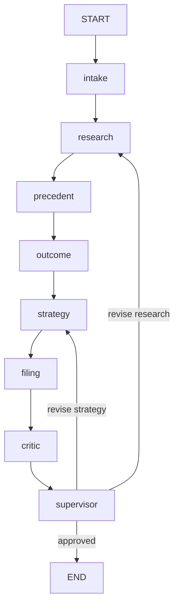

# Legal Intelligence — Production Multi-Agent System

Deployable **LangGraph 2.0** legal intelligence platform with **critic peer review**, **supervisor revision loops**, and production API hardening. Uses [Caselaw Access Project (CAP)](https://case.law/) data.

## Architecture



| Agent | Role |
|--------|------|
| `intake` | Validate & structure matter |
| `research` | CAP + CourtListener retrieval (expands on critique) |
| `precedent_analyst` | Holdings, win rates |
| `outcome_predictor` | Judgment scenarios |
| `strategy` | Win paths + critique revisions |
| `filing` | Draft filing package |
| **`critic`** | **Peer review, quality score, rewrite target** |
| **`supervisor`** | **Approve / send back (max 2 revisions)** |

### Agent interaction

- **Shared state** — each agent reads/writes `LegalCaseState`
- **Messages** — `messages` channel records agent-to-agent notes
- **Critique loop** — critic scores precedents/outcomes/strategy; supervisor routes back to `research` or `strategy`
- **Checkpoints** — optional `thread_id` for session continuity

## Quick start

```bash
python -m venv .venv
.\.venv\Scripts\activate          # Windows
pip install -r requirements.txt
cp .env.example .env

python run.py -i input_examples/01_breach_of_contract.json
python run_ui.py                  # http://localhost:8001
pytest -q
```

## API (production)

| Endpoint | Description |
|----------|-------------|
| `GET /v1/health` | Liveness |
| `GET /v1/ready` | Readiness (index loaded, config warnings) |
| `POST /v1/analyze` | Run full pipeline with critique |

```json
{
  "case": { "title": "...", "jurisdiction": "Arkansas", "court_type": "Circuit Court", "parties": {"plaintiff": "A", "defendant": "B"}, "claims": ["breach of contract"] },
  "thread_id": "optional-session-id"
}
```

Response includes `quality_score`, `revision_count`, `critique_history`, and `legal_caveats`.

## Docker

```bash
docker build -t legal-intelligence .
docker run -p 8001:8001 legal-intelligence
docker run --rm legal-intelligence test
docker run --rm legal-intelligence cli -i input_examples/01_breach_of_contract.json
```

## Configuration

See `.env.example`:

| Variable | Purpose |
|----------|---------|
| `OPENAI_API_KEY` | **Required** — API key for the LLM endpoint |
| `OPENAI_BASE_URL` | **Required** — OpenAI-compatible base URL (e.g. `https://api.openai.com/v1`) |
| `OPENAI_MODEL` | Model name (default `gpt-4o-mini`) |

If either `OPENAI_API_KEY` or `OPENAI_BASE_URL` is missing, or the endpoint is unreachable, the application **raises an error** at startup and before each analysis run.

| Variable | Purpose |
|----------|---------|
| `MAX_REVISIONS=2` | Critique loop cap |
| `CRITIQUE_APPROVAL_THRESHOLD=70` | Minimum critic pass score |
| `COURTLISTENER_API_TOKEN` | Optional live CAP search |

### LLM usage by agent

| Agent | LLM role |
|--------|----------|
| `intake` | Infer legal issues, refine facts |
| `research` | Expand CAP search terms |
| `precedent_analyst` | Holding summaries, pattern analysis |
| `outcome_predictor` | Calibrated judgment scenarios |
| `strategy` | Win strategies and favorable-judgment tactics |
| `filing` | Draft statement of facts, checklist |
| `critic` | Partner-level peer review |
| `supervisor` | Client executive summary |

## Expand CAP corpus

Bulk data: [static.case.law](https://static.case.law/) ([docs](https://case.law/docs/))

```bash
python scripts/build_cap_index.py
```

## Legal caveats

1. **Not legal advice** — research/decision support only.
2. **Predictions are probabilistic** — not guarantees.
3. **Critique is automated** — not substitute for attorney review.
4. **Corpus may be incomplete** — verify citations with counsel.
5. **No e-filing** — drafts only.

## Project layout

```
app/
  agents/       # 8 specialized agents incl. critic + supervisor
  api/          # FastAPI factory, middleware, lifespan
  tools/        # CAP retriever, CourtListener, registry
  graph.py      # LangGraph with conditional revision routing
tests/          # Unit + integration + API smoke tests
```
